<p align="center">
  
</p>

<p align="center">
  <a href="https://github.com/ishandutta2007/Awesome-Awesome-Awesome"></a><a href="https://discord.gg/jc4xtF58Ve"></a>
  <a href="https://github.com/ishandutta2007/Awesome-Receipt-OCR-Platform/stargazers"></a>
  <a href="https://github.com/ishandutta2007/Awesome-Receipt-OCR-Platform/network/members"></a>
  <a href="https://github.com/ishandutta2007/Awesome-Receipt-OCR-Platform/issues"></a>
  <a href="https://github.com/ishandutta2007/Awesome-Receipt-OCR-Platform/blob/main/LICENSE"></a>
  <a href="https://github.com/ishandutta2007"></a>
</p>

---

# 🧾 Awesome Receipt OCR & Expense Intelligence Platform

> **A curated ecosystem of SaaS platforms, deep-learning models, and open-source pipelines for Receipt OCR, Expense Data Extraction, Document AI, and Financial Document Automation.**

The **Receipt OCR & Intelligent Document Processing (IDP)** ecosystem transforms scanned receipts, mobile camera captures, and digital invoice PDFs into structured JSON records. This automated pipeline captures critical financial fields—including merchant names, transaction dates, tax breakdowns, line-item tables, currencies, and payment metadata—powering fintech apps, corporate expense management, bookkeeping automation, ERP reconciliations, and tax compliance workflows.

---

## 📑 Table of Contents

- [📊 Market Size & Industry Dynamics](#-market-size--industry-dynamics)
- [☁️ SaaS / Hosted Platforms](#️-saashosted-platforms)
- [🔓 Open-Source GitHub Repositories](#-open-source-github-repositories)
- [🛠️ Preprocessing, Layout & Orchestration Stack](#️-preprocessing-layout--orchestration-stack)
- [🏗️ Reference Architecture for Self-Hosted Receipt OCR](#️-reference-architecture-for-self-hosted-receipt-ocr)
- [🤝 How to Contribute](#-how-to-contribute)
- [⭐ Star History](#-star-history)
- [📜 Disclaimer](#-disclaimer)

---

## 📊 Market Size & Industry Dynamics

> 💡 **Market Overview & Industry Structure:** The global **Intelligent Document Processing (IDP)** market is estimated at **$3.2B–$4.2B in 2026** and projected to exceed **$30B+ by 2034** at an aggressive **CAGR of ~28–34%**, while the underlying foundational **OCR market** stands at **~$16.5B–$19.8B** (CAGR ~12–14%). 
>
> 🌐 **Fragmentation vs. Concentration:** The Receipt OCR and IDP sector is **moderately-to-highly fragmented rather than a winner-take-all market**. While hyperscalers (Microsoft Azure, AWS, Google Cloud) provide scalable infrastructure and generic vision APIs, specialized vertical players (Veryfi, Mindee, Rossum, Dext) thrive by delivering higher domain accuracy, merchant normalization databases, fraud detection, and direct accounting integrations. Furthermore, rapid advances in open-source vision-language models (VLMs), transformer architectures, and local privacy regulations (GDPR, EU AI Act, HIPAA) sustain a competitive, highly diversified landscape.

---

## ☁️ SaaS / Hosted Platforms

*Commercial APIs and managed cloud services offering turnkey receipt and invoice parsing, line-item table extraction, and accounting sync.*

*Sorted by **Company Scale / Valuation / Revenue (Descending)***:

| Platform / Product | Company Scale / Valuation / Revenue | Description & Capabilities | Starting Pricing | Free Tier / Trial Limits |
| :--- | :--- | :--- | :--- | :--- |
| **Azure AI Document Intelligence** *(Microsoft)* | **~$3.1T+ Market Cap** <br>*(~$245B+ Annual Revenue)* | Enterprise managed document AI service offering prebuilt models for receipts, invoices, and IDs with line-item extraction, key-value pairs, and confidence scores. | **$10.00 per 1,000 pages** ($0.010/page) on Standard S0 Pay-as-you-go tier for prebuilt Receipt & Invoice models | **Free forever (F0 tier):** 500 pages/month (max 2 pages per document, max 4 MB file size). |
| **Google Cloud Document AI** *(Alphabet)* | **~$2.1T+ Market Cap** <br>*(~$350B+ Annual Revenue)* | Google Cloud document understanding platform with a specialized Expense Parser for extracting receipt items, taxes, totals, and payment metadata. | **$0.10 per document count** (1 count = up to 10 pages, effectively $0.01–$0.10/page or $100/1k pages; basic OCR is $1.50/1k pages) | **90-day free trial:** $300 in Google Cloud trial credits for testing Document AI processors (no permanent free tier for Expense Parser). |
| **Amazon Textract** *(Amazon AWS)* | **~$2.0T+ Market Cap** <br>*(~$600B+ Annual Revenue)* | AWS managed document analysis service featuring a specialized `AnalyzeExpense` API for parsing receipts and invoices with line-item and vendor recognition. | **$0.025 per page** for Analyze Expense API (first 100,000 pages/month; drops to $0.010/page beyond 100k; basic text OCR starts at $0.0015/page) | **3-month free trial:** 100 pages/month for Analyze Expense (and 1,000 pages/month for basic text detection). |
| **Rossum** | **~$1.0B+ Valuation** <br>*(Acquired by Coupa; $104M+ Total Funding)* | Cloud-native intelligent document automation platform using transactional AI for end-to-end receipt, invoice, and bill capture in enterprise workflows. | **$18,000/year** (~$1,500/month; Starter annual contract with unlimited seats and core API ingestion) | **14-day free trial** with custom sandbox and sample receipt workflow validation (no permanent free tier). |
| **Dext** *(formerly Receipt Bank)* | **~£500M (~$640M) Valuation** <br>*(Acquired by IRIS Software / Hg Capital; $144M Raised)* | Accounting automation and bookkeeping platform designed to capture and extract receipts, bills, and invoices directly into Xero, QuickBooks, and Sage. | **$31.50/month** ($25.21/month billed annually; includes 5 user seats and up to 250 documents/month) | **14-day free trial** with full receipt capture and extraction access (no credit card required; no permanent free tier). |
| **Nanonets** | **~$250M–$300M Valuation** <br>*($42M Total Raised; Series B led by Accel)* | Automated document processing platform with pre-trained receipt models, human-in-the-loop validation, and custom AI workflow automation. | **$100/month** (Starter tier; includes 100 workflow block runs; pay-as-you-go extraction blocks at $0.10–$0.30/run) | **Free trial credits:** $50 in free trial credits (up to ~500 document pages/block runs, up to 3 users, no credit card required). |
| **Expensify** *(NASDAQ: EXPN)* | **~$170M–$250M Market Cap** <br>*(~$145M+ Annual Revenue)* | Expense management and business card platform featuring SmartScan for automated receipt OCR, mileage tracking, and expense report generation. | **$5/user/month** (Collect plan with accounting sync) or **$9/user/month** (Control plan); Free for personal use | **Free forever:** Unlimited SmartScans for individual users and expense tracking; **6-week free trial** for company business plans. |
| **Mindee (Receipt API)** | **~$100M+ Valuation** <br>*($17M Raised; Series A led by GGV)* | Developer-first document AI API with pre-trained receipt and invoice parsing models covering 50+ countries with line-item, merchant, and tax parsing. | **€44/month** (~$48/mo billed annually; Starter plan includes 500 pages/month or 6,000 annual credits) | **14-day free trial** with 200 pages included for testing (no credit card required; no permanent free tier). |
| **Veryfi OCR API & SDK** | **~$80M–$100M Valuation** <br>*($15M Raised; Y Combinator / Act One)* | AI-powered receipt, invoice, and bill OCR API extracting line items, taxes, totals, vendor details, and currency across 91 currencies and 38 languages. Includes Mobile Lens SDK. | **$500/month** (Starter tier; ~$0.08/receipt, $0.16/invoice up to ~6,250 receipts/month) | **Free forever:** 100 documents/month (with access to all document types & SDKs); **14-day free trial** for full-access platform features (no credit card required). |
| **Klippa (DocHorizon / SpendControl)** | **~$50M–$80M Valuation** <br>*(Acquired by SER Group / Doxis)* | Intelligent document processing API and expense management suite for scanning, classifying, and extracting receipt and invoice data. | **€5/user/month** (SpendControl Expense) or **€95/month** (SpendControl AP Invoice up to 4,000 docs/yr); API priced on volume | **Free trial credits:** €25 in free API testing credits upon registration with a business email (or 14-day platform trial; no permanent free tier). |
| **Docsumo** | **~$40M–$60M Valuation** <br>*($4M Raised; Common Ocean / 500 Startups)* | Intelligent document processing platform for financial documents, extracting line items, tables, and key data points from complex receipts and invoices. | **$299/month** (Growth tier; includes ~1,000 documents/month, ~$0.30 per additional page) | **14-day free trial** with 100 document pages included (no credit card required; no permanent free tier). |
| **Taggun** | **~$10M–$20M Valuation** <br>*(Bootstrapped / Profitable Niche API)* | Real-time receipt OCR and data extraction API optimized for expense management, loyalty platforms, and accounting automation with fast JSON response. | **$28/month** (Developer tier; includes 500 receipt scans/month, overage at $0.056/scan) | **30-day free trial** with unlimited receipt scans in testing/sandbox mode (no credit card required). |
| **OCR.Space** | **~$5M–$15M Valuation** <br>*(Bootstrapped / a9t9 Software)* | Cloud OCR API supporting multi-engine text and table extraction from receipt images and PDFs with searchable structured output. | **$30/month** (PRO plan; includes 300,000 requests/month, SLA, up to 100 MB file size) | **Free forever:** 25,000 requests/month (max 500 requests/day per IP, 1 MB max file size, max 3 pages/PDF). |

---

## 🔓 Open-Source GitHub Repositories

*Open-source OCR engines, neural document vision models, and receipt parsing projects for local, private, and customizable document pipelines.*

*Sorted by **GitHub Star Count (Descending)***:

1. **[OpenCV](https://github.com/opencv/opencv)** [](https://github.com/opencv/opencv/stargazers) — The quintessential open-source computer vision library. Essential for receipt image preprocessing, including perspective warping, shadow removal, adaptive binarization, rotation correction, and edge detection. *(Apache-2.0)*
2. **[PaddleOCR](https://github.com/PaddlePaddle/PaddleOCR)** [](https://github.com/PaddlePaddle/PaddleOCR/stargazers) — Ultra-lightweight, multilingual OCR and document understanding toolkit supporting PP-OCR, PP-Structure, and table recognition. An industry-standard backbone for self-hosted receipt parsing. *(Apache-2.0)*
3. **[Tesseract OCR](https://github.com/tesseract-ocr/tesseract)** [](https://github.com/tesseract-ocr/tesseract/stargazers) — The most widely used classical open-source OCR engine powered by LSTM neural networks. Provides base text detection and extraction for over 100 languages. *(Apache-2.0)*
4. **[MinerU](https://github.com/opendatalab/MinerU)** [](https://github.com/opendatalab/MinerU/stargazers) — High-precision document and PDF parsing engine that converts complex multimodal receipts, financial reports, and scanned images into clean structured JSON and Markdown. *(Apache-2.0)*
5. **[EasyOCR](https://github.com/JaidedAI/EasyOCR)** [](https://github.com/JaidedAI/EasyOCR/stargazers) — Ready-to-use PyTorch deep learning OCR library supporting 80+ languages with minimal configuration, ideal for receipt photograph text recognition. *(Apache-2.0)*
6. **[Docling](https://github.com/DS4SD/docling)** [](https://github.com/DS4SD/docling/stargazers) — IBM Research's advanced document processing library that parses complex document layouts, bounding boxes, and hierarchical receipt structures into unified data models. *(MIT)*
7. **[Surya](https://github.com/VikParuchuri/surya)** [](https://github.com/VikParuchuri/surya/stargazers) — Multilingual document OCR, layout analysis, table recognition, and reading order detection toolkit built for modern vision pipelines. *(GPL-3.0)*
8. **[Marker](https://github.com/VikParuchuri/marker)** [](https://github.com/VikParuchuri/marker/stargazers) — Fast, high-accuracy deep learning pipeline for converting receipts, invoices, and PDFs into structured Markdown with layout fidelity. *(GPL-3.0)*
9. **[OCRmyPDF](https://github.com/ocrmypdf/OCRmyPDF)** [](https://github.com/ocrmypdf/OCRmyPDF/stargazers) — Adds OCR text layers to scanned PDF receipts, repairs damaged PDF content streams, and ensures PDF/A compliance for financial archival. *(MPL-2.0)*
10. **[Nougat](https://github.com/facebookresearch/nougat)** [](https://github.com/facebookresearch/nougat/stargazers) — Meta AI's Neural Optical Understanding transformer model that parses formatted document images and tabular content into clean markup. *(MIT)*
11. **[Donut](https://github.com/clovaai/donut)** [](https://github.com/clovaai/donut/stargazers) — OCR-free Document Understanding Transformer from Clova AI that maps receipt and invoice images directly to structured JSON trees without an intermediate OCR step. *(MIT)*
12. **[PyTesseract](https://github.com/madmaze/pytesseract)** [](https://github.com/madmaze/pytesseract/stargazers) — Python wrapper for Google's Tesseract-OCR Engine, widely used as the default bridge for receipt text extraction in Python scripts. *(Apache-2.0)*
13. **[docTR](https://github.com/mindee/doctr)** [](https://github.com/mindee/doctr/stargazers) — End-to-end document text recognition toolkit created by Mindee, pairing cutting-edge text detection (DBNet) and recognition (CRNN/SAR/ViT) models in PyTorch & TensorFlow. *(Apache-2.0)*
14. **[LayoutParser](https://github.com/Layout-Parser/layout-parser)** [](https://github.com/Layout-Parser/layout-parser/stargazers) — Deep learning toolkit for document image analysis, layout detection, and table localization on complex receipt scans. *(Apache-2.0)*
15. **[GOT-OCR2.0](https://github.com/Ucas-HaoranWei/GOT-OCR2.0)** [](https://github.com/Ucas-HaoranWei/GOT-OCR2.0/stargazers) — General OCR Theory 2.0 model unifying plain text OCR, formatted financial tables, and chart extraction under a unified multimodal architecture. *(Apache-2.0)*
16. **[Keras-OCR](https://github.com/faustomorales/keras-ocr)** [](https://github.com/faustomorales/keras-ocr/stargazers) — Packaged deep learning OCR pipeline combining CRAFT text detection and CRNN recognition built on Keras and TensorFlow. *(MIT)*
17. **[invoice2data](https://github.com/invoice-x/invoice2data)** [](https://github.com/invoice-x/invoice2data/stargazers) — Template and regex-based data extractor for PDF receipts and invoices with support for multiple OCR backends and ERP export formats. *(MIT)*
18. **[DeepDoctection](https://github.com/deepdoctection/deepdoctection)** [](https://github.com/deepdoctection/deepdoctection/stargazers) — Orchestrator package for complex document pipelines, integrating layout detection, table recognition, OCR, and NER extraction models. *(Apache-2.0)*
19. **[Calamari OCR](https://github.com/Calamari-OCR/calamari)** [](https://github.com/Calamari-OCR/calamari/stargazers) — Fast neural network OCR engine based on TensorFlow, designed for deep learning text line recognition and voting ensembles. *(Apache-2.0)*
20. **[Kraken](https://github.com/mittagessen/kraken)** [](https://github.com/mittagessen/kraken/stargazers) — Turnkey OCR system with trainable segmentation and recognition models suited for non-standard receipts and scripts. *(Apache-2.0)*
21. **[Open Receipt OCR](https://github.com/mre/open-receipt-ocr)** [](https://github.com/mre/open-receipt-ocr/stargazers) — Self-hosted privacy-first receipt OCR application supporting interchangeable local engines (PaddleOCR, Tesseract.js). *(MIT)*
22. **[OpenReceipts](https://github.com/OpenReceipts/OpenReceipts)** [](https://github.com/OpenReceipts/OpenReceipts/stargazers) — Local, private receipt scanner app that extracts merchant, total, date, and line items without sending documents to cloud providers. *(MIT)*
23. **[receipt-ocr](https://github.com/arshadansari27/receipt-ocr)** [](https://github.com/arshadansari27/receipt-ocr/stargazers) — Lightweight FastAPI service wrapping Tesseract OCR for automated receipt text extraction and rule-based JSON formatting. *(MIT)*

---

## 🛠️ Preprocessing, Layout & Orchestration Stack

*Essential modular libraries for assembling end-to-end receipt extraction pipelines:*

- 🖼️ **Document Preprocessing & PDF Extraction:**
  - **[PyMuPDF](https://github.com/pymupdf/PyMuPDF)** — High-performance PDF parsing and image rendering engine.
  - **[pdfplumber](https://github.com/jsvine/pdfplumber)** — Detailed character, line, and rectangle coordinate extraction from digital PDFs.
  - **[pdf2image](https://github.com/Belval/pdf2image)** — Converts PDF receipt pages into PIL image buffers for OCR models.
  - **[Unstructured](https://github.com/Unstructured-IO/unstructured)** — Ingestion and preprocessing pipeline for multi-format financial documents.

- 🧠 **LLM Extraction, Validation & Semantic Parsing:**
  - **[LangChain](https://github.com/langchain-ai/langchain)** / **[LlamaIndex](https://github.com/run-llama/llama_index)** — Connect OCR token bounding boxes with LLMs for schema-enforced JSON generation.
  - **[Transformers](https://github.com/huggingface/transformers)** — Run multimodal Vision-Language Models (Donut, LayoutLMv3, Kosmos, Qwen-VL) for zero-shot receipt parsing.
  - **[Instructor](https://github.com/jxnl/instructor)** — Structured data extraction from OCR text using Pydantic schemas.

- ⚙️ **Production Serving & Queuing:**
  - **[FastAPI](https://github.com/tiangolo/fastapi)** — High-throughput asynchronous REST API backend.
  - **[Celery](https://github.com/celery/celery)** + **[Redis](https://github.com/redis/redis)** — Task queue for distributed asynchronous document batches.
  - **[MinIO](https://github.com/minio/minio)** + **[PostgreSQL](https://github.com/postgres/postgres)** — Self-hosted S3-compatible object storage and relational ledger for parsed expense records.

---

## 🏗️ Reference Architecture for Self-Hosted Receipt OCR

```
  ┌─────────────────┐       ┌────────────────────────┐       ┌─────────────────────────┐
  │ Receipt Capture │ ----> │ Image Preprocessing    │ ----> │ Optical Text Detection  │
  │ (Photo / PDF)   │       │ (OpenCV / deskew / crop│       │ (PaddleOCR / EasyOCR /  │
  └─────────────────┘       └────────────────────────┘       │  docTR / Tesseract)     │
                                                              └────────────┬────────────┘
                                                                           │
  ┌─────────────────┐       ┌────────────────────────┐                     ▼
  │  ERP / Database │ <---- │ Schema Validation      │ <---- ┌─────────────────────────┐
  │  (Postgres/JSON)│       │ (Pydantic / Confidence)│       │ Semantic Field Parsing  │
  └─────────────────┘       └────────────────────────┘       │ (VLM / LLM / Regex / NER│
                                                             └─────────────────────────┘
```

1. **Capture & Ingestion:** Ingest via mobile camera scan, web upload, email hook, or batch PDF drop.
2. **Preprocessing:** Use `OpenCV` to detect receipt quad borders, correct perspective skew, normalize contrast, and remove background noise.
3. **Text & Bounding Box OCR:** Run `PaddleOCR` or `docTR` to yield token coordinates and text sequences.
4. **Layout & Table Extraction:** Extract table lines and bounding boxes using `Surya` or `LayoutParser`.
5. **Semantic Entity Extraction:** Pass tokens and bounding boxes to a local VLM or fine-tuned LLM with structured schemas (Merchant, Date, Line Items, Tax, Total).
6. **Validation & Storage:** Validate mathematical parity (`Subtotal + Tax == Total`), persist artifacts to `MinIO`, and insert structured records into `PostgreSQL`.

---

## 🤝 How to Contribute

Contributions are warmly welcomed! Help expand this ecosystem tracker:

1. 🍴 **Fork the repository**.
2. 🌿 **Create a new branch** (`git checkout -b feature/add-tool-name`).
3. 📝 **Add your entry** to the appropriate section following the existing format:
   - For SaaS: Name, Valuation/Scale, Description, Specific Starting Price, and Specific Free Tier/Trial limits.
   - For Open-Source: Name, GitHub URL, social star badge linked to stargazers, 1–2 sentence description, and license.
4. 🚀 **Submit a Pull Request** with a clear description of your addition.
5. ⭐ **Star the repo** if you find it helpful!

---

## ⭐ Star History

[](https://star-history.dera.page/#ishandutta2007/Awesome-Receipt-OCR-Platform&type=date&legend=top-left)

---

## 📜 Disclaimer

*This repository is a community-curated directory intended for research, architectural planning, and educational purposes. Mentions of SaaS vendors and open-source packages do not constitute an endorsement. Pricing, feature sets, and repository metrics are subject to continuous evolution by their respective authors and providers. Always verify software licenses, data privacy compliance (GDPR/SOC2/HIPAA), and security postures before processing production financial records.*
